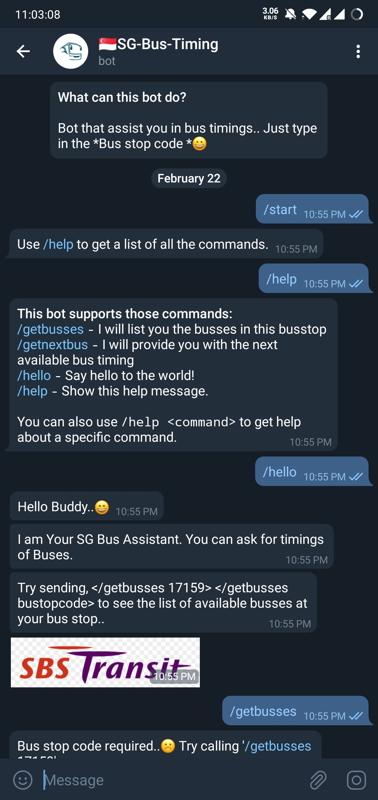
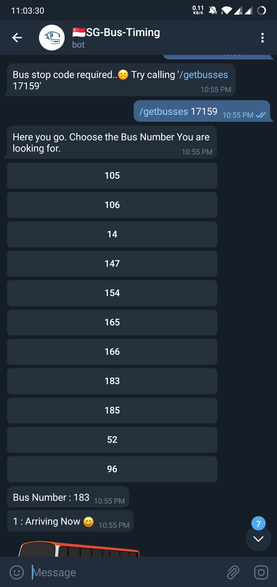
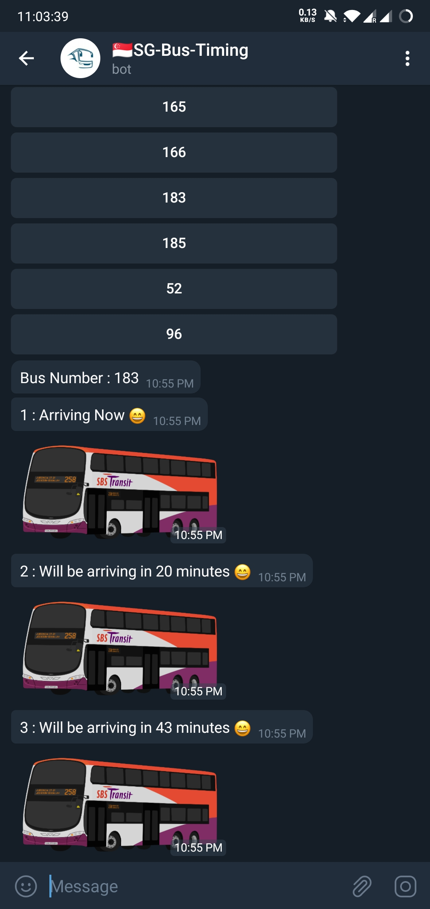

# SimpleTelegramBot

- # Sg Bus timing -- Telegram Bot


- Update your API_KEYS & TOKENS
```python
TOKEN = "<TELEGRAM_BOT_TOKEN>"
acc_key = "<API_KEY_FOR_MIN_API>"
```

- Reference for "<TELEGRAM_BOT_TOKEN>"
	- https://www.botogram.dev/docs/0.4/bot-creation/
- Reference for "<API_KEY_FOR_MIN_API>"
	- https://www.mytransport.sg/content/mytransport/home/dataMall.html


Output:







[](https://youtu.be/6DBSEdOVnBU)

